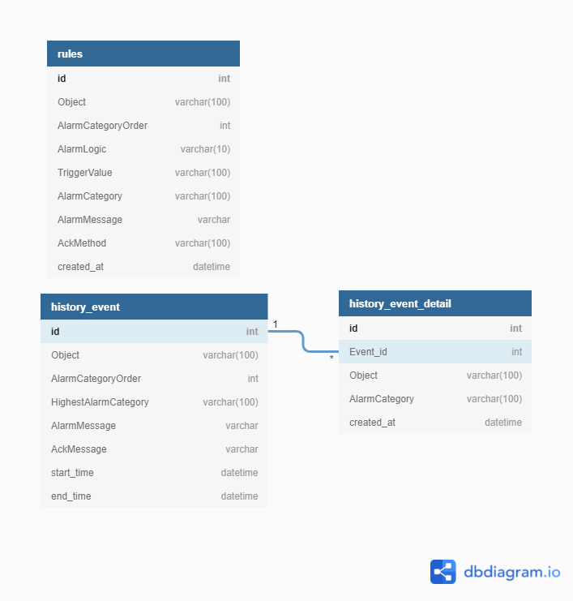

# H project

## 模組需求

1. REST server
   - 接收modbus上傳數據
   - 開API對接client應用
2. account
   - 帳密驗證
   - token驗證
3. history
   - sensor data寫進DB
   - 從DB讀sensor data
4. alarm
   - 計算sensor上傳的值是否觸發alarm或解除alarm
   - 產生alarm清單及寫進DB
   - 寫入人員ack的信息

## alarm模組需要的功能
1. 起gRPC server接Gin server傳來的message
   <!-- DONE -->
   (1) 寫一個rpc->InitAlarmRules, 將alarm csv寫入sql, 寫入前會truncate, 初始化或是想清掉整張rule表重建時可用
   <!-- TODO -->
   (2) 開發alarm rules CRUD的rpc
   <!-- TODO -->
   (3) history新增與查詢的rpc, 查詢嘗試做stream
   <!-- TODO -->
   (4) ack message的rpc
   <!-- TODO -->
   (5) sensor data接收的rpc
<!-- TODO -->
2. 將alarm event存cache
<!-- TODO -->
3. 判斷是否觸發alarm或解除alarm
<!-- TODO --> 
4. alarmevent存DB

```sh
#sqlc
sqlc generate
# grpc
protoc -I=. --go_out=plugins=grpc:pkg proto/*.proto
```



